# Goby的POC

**2023年4月19日更新，共184个POC**

以下是写Goby发现的一些问题：

1、就是没办法判断延时注入，好些漏洞是sql注入漏洞，但是是延时注入的，没有找到通过判断延时来验证漏洞是否存在的。

2、poc中似乎不能带有反引号，比如一个payload是name=\`id\`，这个poc就没有被goby加载到，我比较菜不知道原因。

3、goby可以提取响应包的特定内容来赋值给变量，可以用来下次使用，但是如果响应包中的匹配到的内容需要替换一部分就没法做，如：文件上传后响应包中返回upload\\/images\\/xxxx.aspx，我怎么才能提取这个地址的同时，把\去掉呢？

4、我发现goby的指纹归类有点乱。

 举个例子Jeecg-Boot平台的资产时，发现有两个app。 

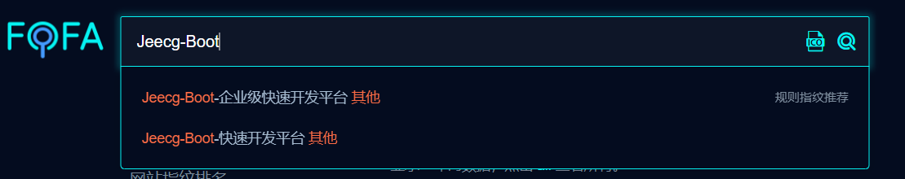

 但是这两个app中的内容似乎都是属于Jeecg-Boot平台的，我看着界面很相似，不知道差异是啥。 

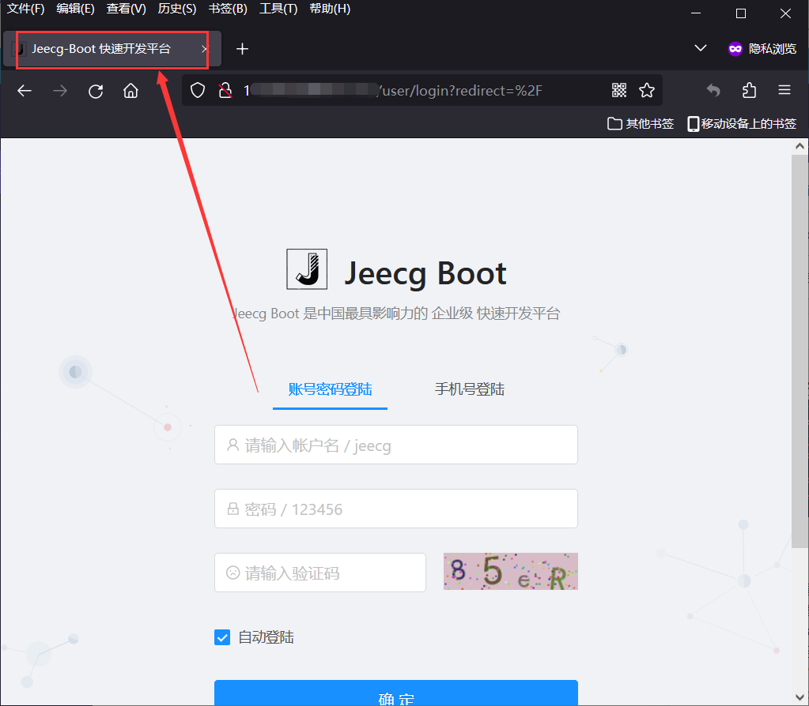

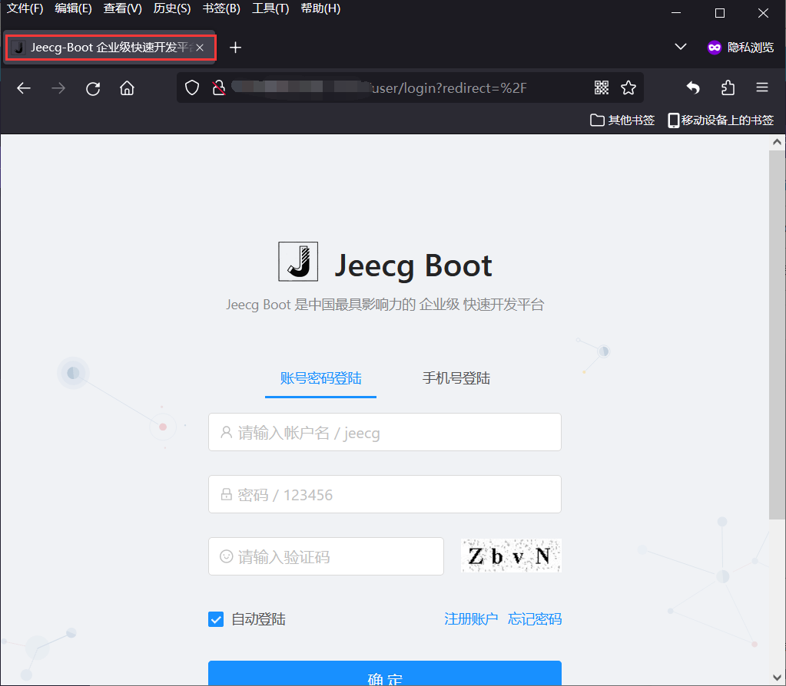

 我也不知道你们怎么定义的这个所谓的app的指纹，难道就是通过简单的title？有时候确实挺粗糙，关键不是这个，我试图找一下他们的共性，因为写poc怕漏扫了，于是我把规则改成了body="Jeecg-Boot"，结果出来了很多内容，我怕有大量误报我就抽几个访问了一下看看。 

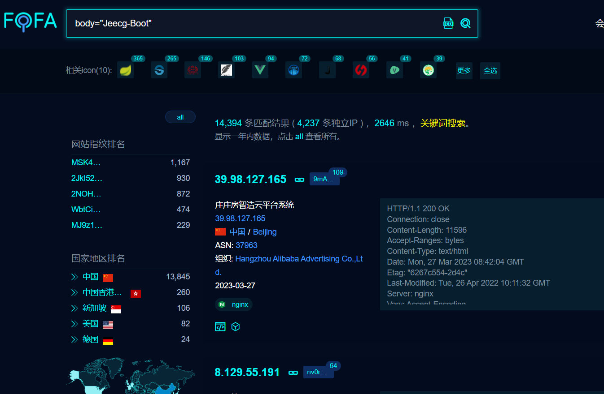

 感觉根本就是属于Jeecg-Boot的，但是为什么没有归属到app的指纹里呢？我不知道。 

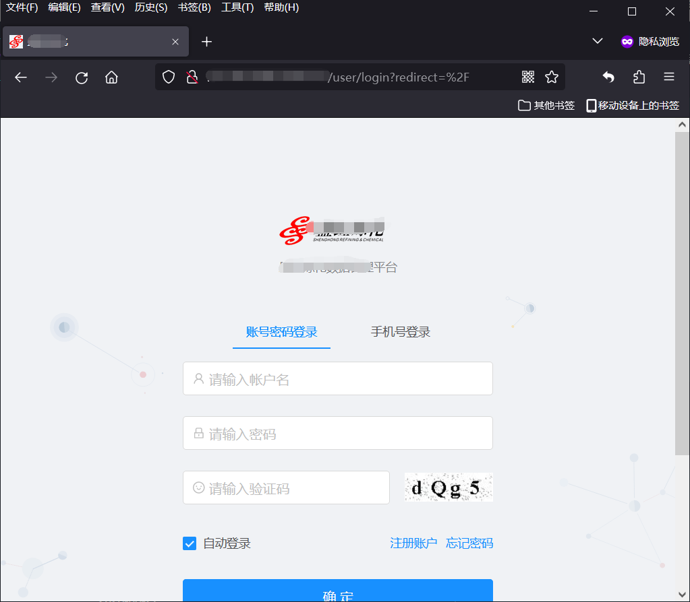

再举个例子

我自己写了一个扫tomcat弱口令的poc，当然就试一下admin/admin，tomcat/tomcat这种，虽然goby带有爆破，但是平时怕跑ssh和其他服务弱口令锁了系统，就感觉还是写一个这种很简单的，说不定某次扫描能给自己带来一个惊喜。

我规则是这样写的app="APACHE-Tomcat" && "/manager/html"，试了一下能搜到很多数据的，就这个了。

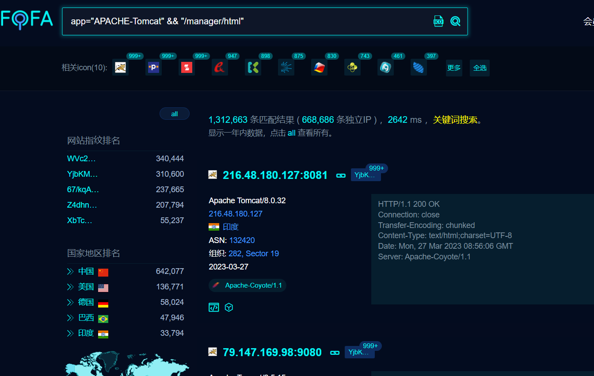

 再然后我打开了一个vulfocus的靶场来测试一下，结果没扫到。 

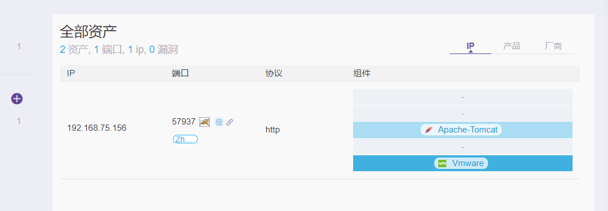

 我觉得不应该啊，这东西我都看到指纹识别出tomcat了，图标都出现了，我就点了一下这个指纹，发现指纹是product="Apache-Tomcat"。 

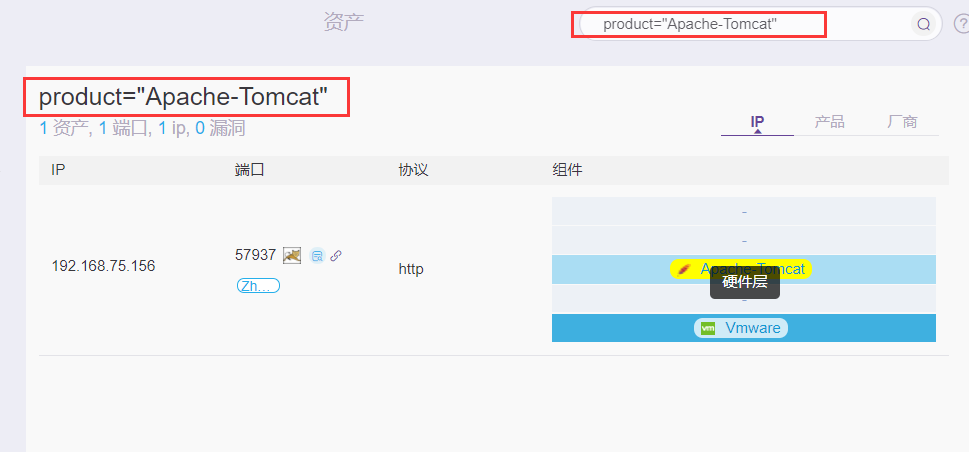

？？？？你tm到底是个啥？app？还是server？还是product？

无奈之下我改成了这个app="APACHE-Tomcat" || product="Apache-Tomcat"，然后就扫到了。

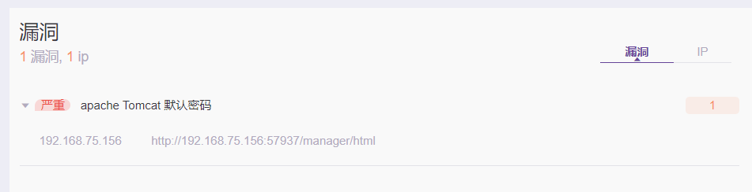

更牛逼的是，我后面发现，万物皆可product

哎，我管你是什么框架也好

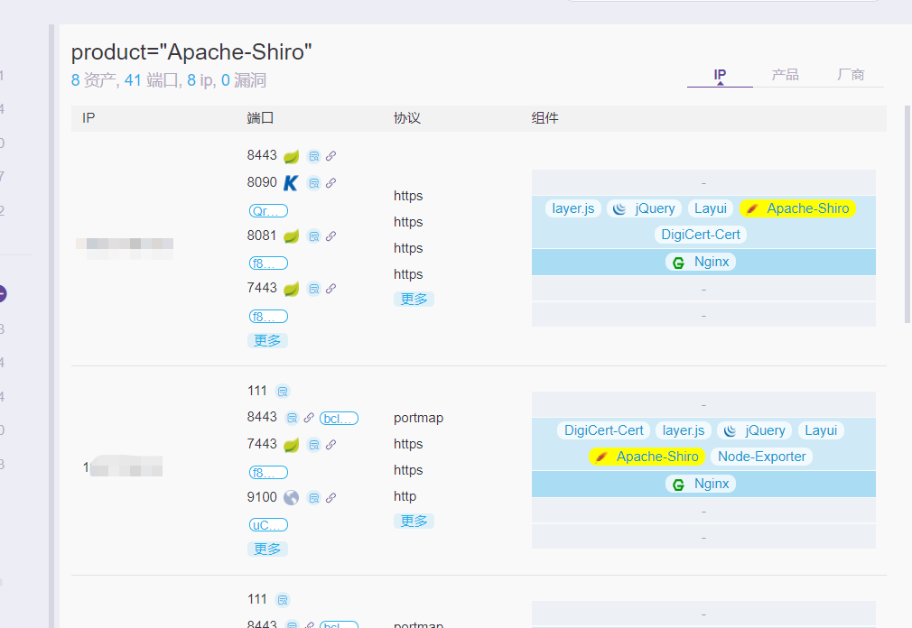

应用也好。

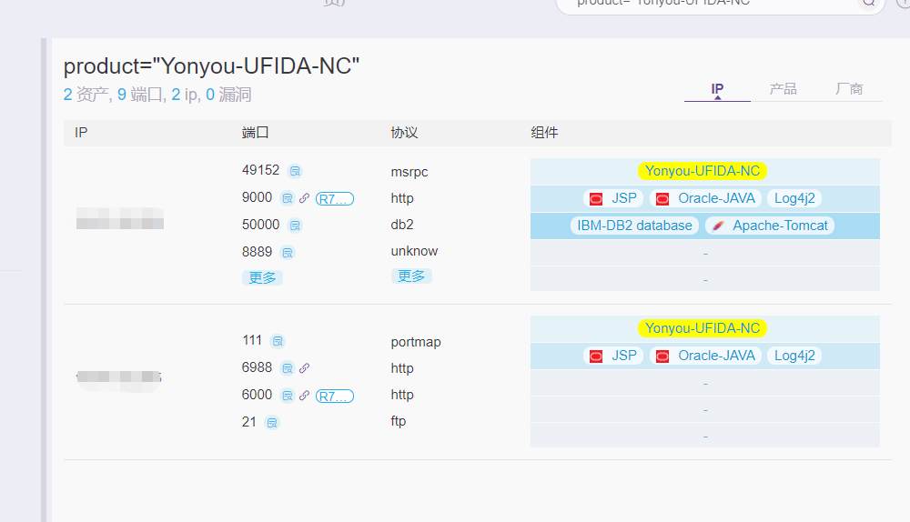

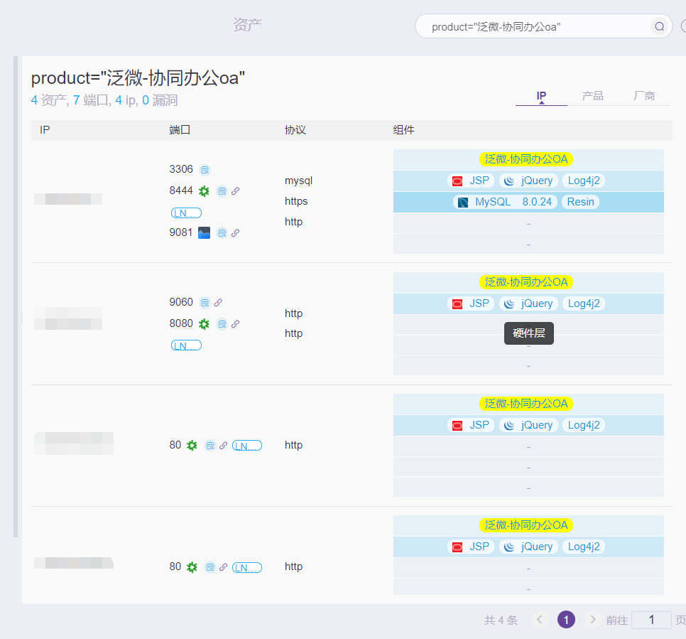

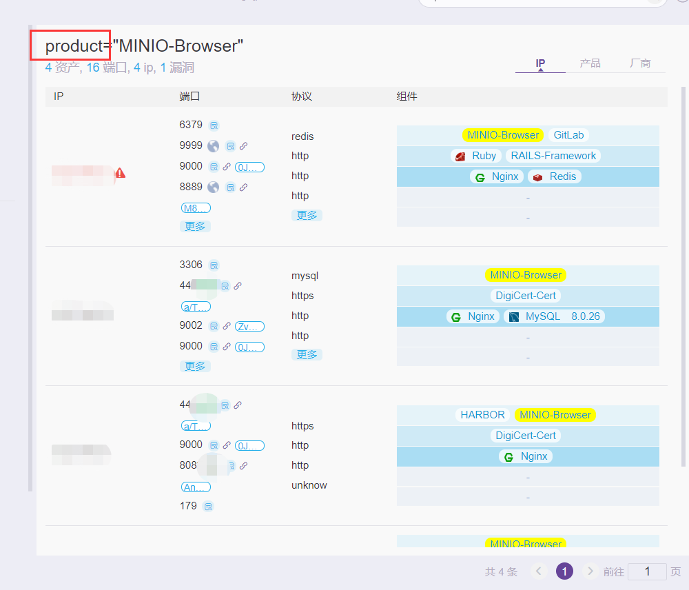

还是上面说的tomcat中间件也好，我全product。

5、不知何种原因，明明我写了181个poc，加官方内置总的有514个poc，正常也会显示514的，一开始扫描，poc就变少了，不是493就是506、508，不懂不懂啊，还有些奇奇怪怪的bug，指纹识别不到。

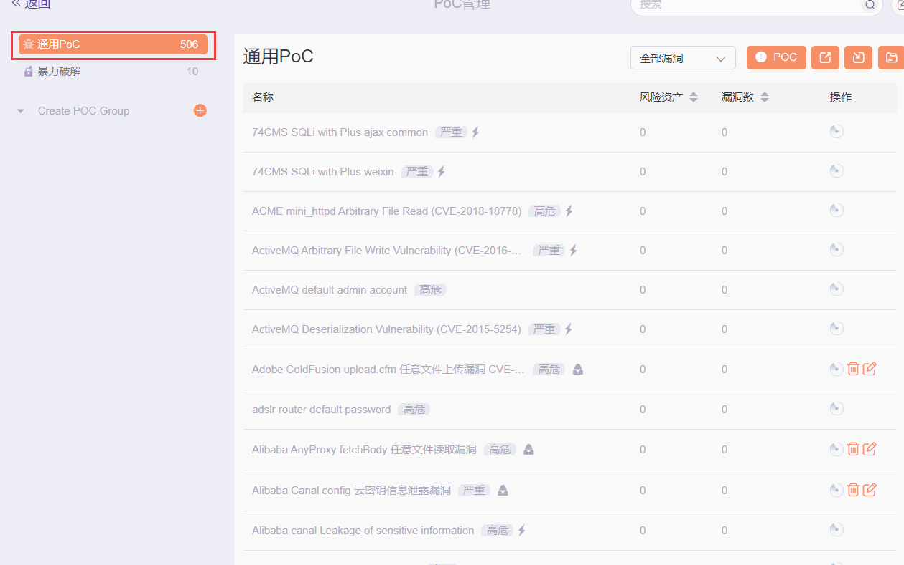

宁愿多扫，出现误报，也不愿意漏扫。

还是用人家xray就好，人家内置那么多的poc，反正基本不用自己写，脚本小子就要有脚本小子的觉悟。

最后建议，写goby的poc用的规则还是用我上面那个例子Jeecg-Boot一样的，去找找body中的特性，然后写body="Jeecg-Boot"，别用官方的什么app或者什么乱七八糟的，妈呀，乱，指纹识别不到。而且指纹尽量放宽，反正我是觉得**宁愿多扫，出现误报，也不愿意漏扫**。

我是个垃圾！没办法！
